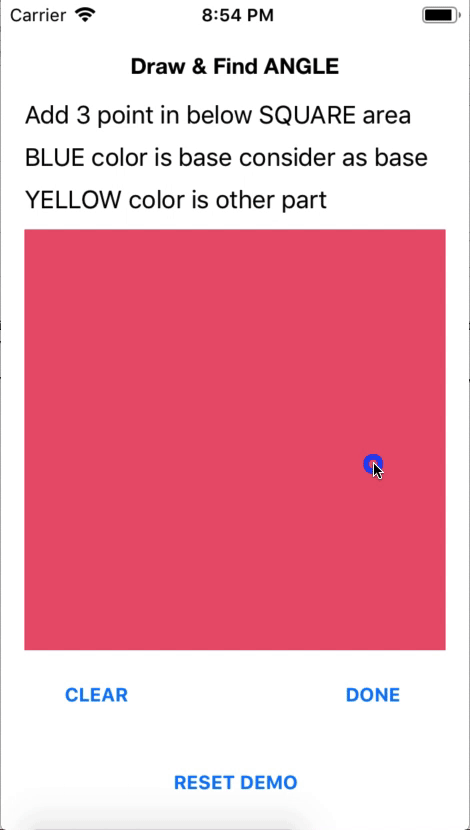

# Angle-Draw-Swift

This is simple Swift programming iOS application demo about draw angle which is form with 3 different points on any UIView.
Also, calculation available for created angle.

Using this demo; User can draw multiple angle with it's calcualtion on a single UIView. So, Check out below instructions. Check below gif as Output:

# Output:

# Basic Config:

1. Xcode 10.0 or above
2. Swift 4.0 or above
3. Development Target 10.0 or above
4. Device Universal Supported

# How it Works?

You just need to download this demo and run it inot SIMULATOR or REAL device whatever you want. Find centre colored SQUARE area which is UIView. 

Tap different three points in that view. Each tap has draw small circle which consider as points and 2 dots connect automatic with line draw. After successfully placed 3rd point, you can see calculated angle near the centre point (2nd point).

# General Info:

Demo has mainly 2 color code: (You can easily choose your color in ViewController.swift file)

1. BLUE color -> BASE of Angle Calculation
2. YELLOW color -> Other part of Angle

Demo has 3 different button which are:

1. Clear -> This button used for clear recently points or line which is drawn on UIView. There are multiple angle drawn functionality. So, when you tap this button it's clear recently added points & lines only.

2. Done -> This button used for finalized angle means all 3 dots are correct place & calucaltion of angle is correct. Now, once you tap this button and again tap on UIView it will consider as another angle.

3. RESET DEMO -> This button helps clear UIView completely for restart the demo.

# Helpful!!

Is this demo helpful for your project? OR Reducing tiny bit of work in your project?
Buy me a Cup of TEA 🔥🔥🔥

